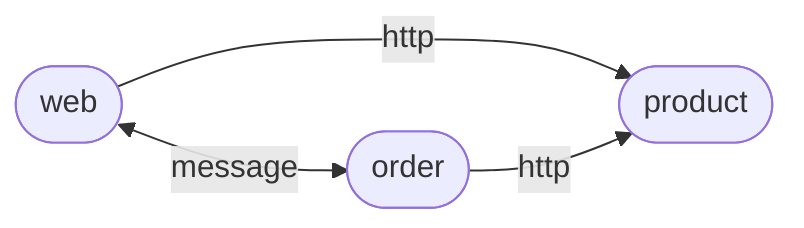

## A simple microservice app to demonstrate `Dapr` adoption to .NET app

### Architecture

#### Service interaction



---

#### Dapr adoption


---

### Prerequisites
- Install Dapr CLI (https://github.com/dapr/cli)
- With Docker installed
  - Initialize Dapr runtime with `dapr init`
- Without Docker installed
  - Initialize Dapr runtime with `dapr init --slim`
  - Install redis server

### How to start

```shell
cd src/web
dapr run -f .
```

Open `src/web/web.http` in `VS` or `VSCode` to test the app.

> To run the app on Windows or without Docker, you need to initialize Dapr runtime in slim mode. And to enable Dapr Actor feature, you'll need to run Dapr placement service with `%USERPROFILE%/.dapr/bin/placement -port 6050`;