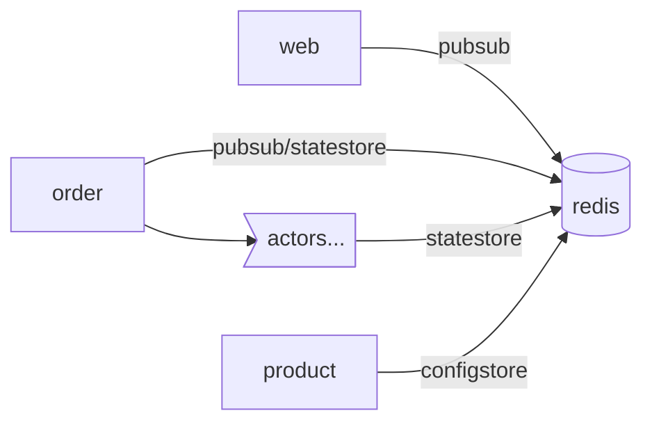

## A simple microservice app to demonstrate `dapr` adoption to .NET app

### Architecture
#### Service interaction


---

#### Dapr adoption


---

### How to start

```shell
cd src/web
dapr run -f .
```

Open `src/web/web.http` in `VS` or `VSCode` to test the app.

> To run the app on Windows, you need to initialize dapr runtime in slim mode. And to enable dapr Actor feature, you'll need to run dapr placement service with `%USERPROFILE%/.dapr/bin/placement.exe -port 6050`;